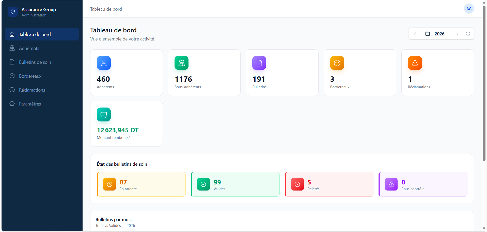
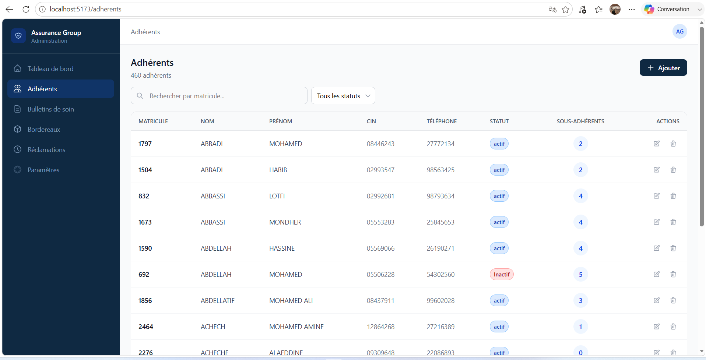
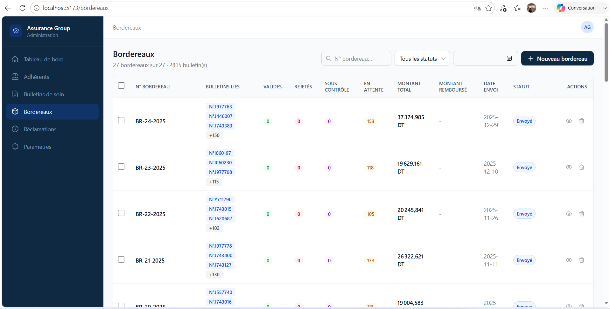
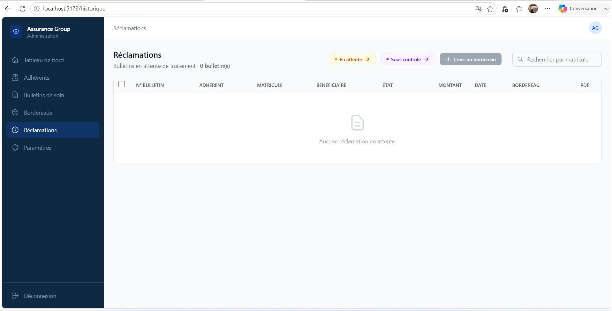

# 🛡️ Assurance Group — Système de Gestion des Assurances Santé



> **Application web de gestion des adhérents, bulletins de soin, bordereaux et réclamations pour une compagnie d'assurance santé.**

---

## 📋 Table des matières

- [Aperçu](#-aperçu)
- [Fonctionnalités](#-fonctionnalités)
- [Stack technique](#-stack-technique)
- [Structure du projet](#-structure-du-projet)
- [Installation](#-installation)
- [Guide d'utilisation](#-guide-dutilisation)
- [Captures d'écran](#-captures-décran)
- [API](#-api)
- [Licence](#-licence)

---

## 🎯 Aperçu

**Assurance Group** est une application web complète conçue pour la gestion administrative des dossiers d'assurance santé. Elle permet aux agents d'assurance de :

- Gérer les **adhérents** (assurés) et leurs **sous-adhérents** (conjoints, enfants)
- Créer et suivre des **bulletins de soin** (déclarations de frais médicaux)
- Regrouper les bulletins en **bordereaux** à soumettre à la STIP
- Traiter les **réponses PDF** de la STIP et mettre à jour les statuts automatiquement
- Suivre les **réclamations** et leur cycle de traitement
- Visualiser les **statistiques** avec des graphiques interactifs
- **Importer des données** depuis des fichiers Excel

---

## ✨ Fonctionnalités

### 📊 Tableau de bord
- Vue d'ensemble des statistiques clés (adhérents, bulletins, bordereaux)
- Graphique mensuel des bulletins de soin
- Indicateurs d'état des bulletins (En attente, Validés, Rejetés, Sous contrôle)
- Filtrage par année

### 👥 Gestion des adhérents
- CRUD complet avec formulaire de création/édition
- Recherche par matricule
- Filtrage par statut (Actif/Inactif)
- Pagination intégrée
- Vue détaillée d'un adhérent avec ses sous-adhérents et bulletins
- Gestion des sous-adhérents (enfants, conjoints)



### 📄 Bulletins de soin
- Création et gestion des bulletins avec détails de soins
- Importation Excel avec détection automatique des colonnes
- Regroupement intelligent des lignes par numéro de bulletin
- Mapping automatique des types de soin
- Aperçu PDF intégré
- Téléchargement des PDF
- Statuts : En attente, Validé, Rejeté, Sous contrôle
- Visualisation des données extraites du PDF réponse STIP


### 📦 Bordereaux
- Création de bordereaux en regroupant plusieurs bulletins
- Envoi à la STIP et suivi du traitement
- Upload et parsing automatique du PDF de réponse STIP
- Extraction des données de remboursement par bénéficiaire
- Validation et comparaison entre les montants déclarés et remboursés
- Historique des actions (logs)



### 🔄 Réclamations
- Gestion des bulletins en attente et sous contrôle
- Filtrage par statut
- Création rapide de bordereaux depuis les réclamations
- Sélection multiple avec barre d'actions flottante
- Aperçu PDF des bulletins
- Vue détaillée avec informations extraites du PDF STIP



### ⚙️ Paramètres
- Modification de l'adresse email de l'administrateur
- Changement de mot de passe

---

## 🛠️ Stack technique

### Frontend
| Technologie | Version |
|------------|---------|
| **React** | 19.x |
| **Vite** | 8.x |
| **Tailwind CSS** | 4.x |
| **Recharts** | 3.x |
| **React Router DOM** | 7.x |
| **Axios** | 1.x |
| **xlsx** (SheetJS) | 0.18.x |

### Backend
| Technologie | Version |
|------------|---------|
| **Laravel** | 13.x |
| **PHP** | 8.3+ |
| **Sanctum** | 4.x (API tokens) |
| **MySQL** | - |
| **smalot/pdfparser** | 2.x |

---

## 📁 Structure du projet

```
assurance-group/
├── backend/                    # API Laravel
│   ├── app/
│   │   ├── Http/
│   │   │   ├── Controllers/
│   │   │   │   └── Api/        # Contrôleurs API
│   │   │   │       ├── AdherentController.php
│   │   │   │       ├── AuthController.php
│   │   │   │       ├── BordereauController.php
│   │   │   │       ├── BulletinSoinController.php
│   │   │   │       ├── DashboardController.php
│   │   │   │       └── SousAdherentController.php
│   │   │   └── Requests/       # Validation des requêtes
│   │   ├── Models/             # Modèles Eloquent
│   │   │   ├── Adherent.php
│   │   │   ├── Bordereau.php
│   │   │   ├── BordereauLog.php
│   │   │   ├── BulletinSoin.php
│   │   │   ├── BulletinSoinDetail.php
│   │   │   ├── SousAdherent.php
│   │   │   └── User.php
│   │   └── Services/
│   │       └── StipPdfParser.php    # Parsing des PDF STIP
│   ├── database/
│   │   └── migrations/         # Migrations SQL
│   └── routes/
│       └── api.php             # Routes API
│
├── frontend/                   # Application React
│   └── src/
│       ├── components/         # Composants réutilisables
│       │   ├── ExcelImportModal.jsx
│       │   ├── Layout.jsx
│       │   ├── LogHistory.jsx
│       │   └── SearchableSelect.jsx
│       ├── pages/              # Pages de l'application
│       │   ├── Dashboard.jsx
│       │   ├── Adherents.jsx
│       │   ├── AdherentDetails.jsx
│       │   ├── Bulletins.jsx
│       │   ├── Bordereaux.jsx
│       │   ├── Historique.jsx
│       │   ├── Login.jsx
│       │   └── Parametres.jsx
│       └── services/
│           └── api.js          # Configuration Axios
│
├── annex/                      # Annexes & ressources
│   ├── img/                    # Captures d'écran
│   └── *.xlsx                  # Fichiers Excel de référence
│
├── db/                         # Base de données
│   └── assurance_group.sql     # Structure SQL complète
│
└── api/                        # Point d'entrée API (legacy)
```

---

## 🚀 Installation

### Prérequis
- PHP 8.3+
- Composer
- Node.js 20+
- MySQL
- Serveur web (Apache/Nginx) ou Laravel Valet/Herd

### 1. Cloner le projet

```bash
git clone <url-du-repository>
cd assurance-group
```

### 2. Installer le backend (Laravel)

```bash
cd backend
composer install
cp .env.example .env
php artisan key:generate
```

Configurez la base de données dans le fichier `.env` :

```env
DB_CONNECTION=mysql
DB_HOST=127.0.0.1
DB_PORT=3306
DB_DATABASE=assurance_group
DB_USERNAME=root
DB_PASSWORD=
```

Importez la structure de la base de données :

```bash
mysql -u root -p assurance_group < ../db/assurance_group.sql
```

Ou utilisez les migrations Laravel :

```bash
php artisan migrate
```

### 3. Installer le frontend (React)

```bash
cd ../frontend
npm install
```

### 4. Lancer l'application

**Démarrer le backend :**

```bash
cd backend
php artisan serve --host=0.0.0.0 --port=8000
```

**Démarrer le frontend (dans un second terminal) :**

```bash
cd frontend
npm run dev
```

L'application sera accessible sur `http://localhost:5173` (ou un autre port attribué par Vite).

---

## 📖 Guide d'utilisation

### Connexion
Connectez-vous avec vos identifiants administrateur. La page de connexion est la page d'accueil par défaut.

### Gestion des adhérents
1. Naviguez vers **Adhérents** dans le menu latéral
2. Cliquez sur **Ajouter** pour créer un nouvel adhérent
3. Remplissez les informations (Matricule, CIN, Nom, Prénom, etc.)
4. Utilisez la barre de recherche pour filtrer par matricule
5. Cliquez sur un adhérent pour voir ses détails et sous-adhérents

### Création de bulletins de soin
1. Allez dans **Bulletins de soin**
2. Cliquez sur **Ajouter** ou utilisez l'**Import Excel**
3. Pour l'import Excel :
   - Sélectionnez un fichier Excel au format STIP
   - Les colonnes sont détectées automatiquement
   - Vérifiez le mapping et validez
   - Confirmez l'importation

### Création de bordereaux
1. Sélectionnez les bulletins à regrouper
2. Cliquez sur **Créer un bordereau** depuis la page des réclamations
3. Assignez un numéro de bordereau unique
4. Envoyez le bordereau à la STIP et importez le PDF de réponse pour traitement automatique

### Traitement des réponses STIP
1. Dans la page des **Bordereaux**, ouvrez le bordereau traité
2. Téléchargez le PDF de réponse STIP
3. Le système parse automatiquement le PDF et extrait :
   - Les montants remboursés par bénéficiaire
   - Les statuts (Validé/Rejeté)
4. Validez ou ajustez les montants extraits
5. Les bulletins sont mis à jour automatiquement

---

## 📸 Captures d'écran

### Tableau de bord
Vue d'ensemble avec les statistiques et graphiques interactifs.


### Adhérents
Gestion complète des assurés avec recherche et filtrage.


### Bulletins de soin
Création, import Excel et suivi des bulletins.


### Bordereaux
Regroupement des bulletins et traitement des réponses STIP.


### Réclamations
Suivi des bulletins en attente et création de bordereaux.


---

## 🌐 API

L'API REST est construite avec Laravel Sanctum pour l'authentification par token.

### Endpoints principaux

| Méthode | Endpoint | Description |
|---------|----------|-------------|
| `POST` | `/api/login` | Authentification |
| `POST` | `/api/logout` | Déconnexion |
| `GET` | `/api/dashboard/stats` | Statistiques générales |
| `GET` | `/api/dashboard/stats/monthly` | Statistiques mensuelles |
| `GET` | `/api/adherents` | Liste des adhérents |
| `POST` | `/api/adherents` | Créer un adhérent |
| `PUT` | `/api/adherents/{id}` | Modifier un adhérent |
| `DELETE` | `/api/adherents/{id}` | Supprimer un adhérent |
| `GET` | `/api/bulletins` | Liste des bulletins |
| `POST` | `/api/bulletins` | Créer un bulletin |
| `POST` | `/api/bulletins/import-excel` | Import Excel de bulletins |
| `GET` | `/api/bulletins/{id}/pdf` | Télécharger le PDF d'un bulletin |
| `GET` | `/api/bordereaux` | Liste des bordereaux |
| `POST` | `/api/bordereaux` | Créer un bordereau |
| `PUT` | `/api/bordereaux/{id}` | Modifier un bordereau |
| `POST` | `/api/bordereaux/{id}/upload` | Upload du PDF de réponse STIP |
| `POST` | `/api/bordereaux/{id}/verify` | Lancer la vérification |
| `PUT` | `/api/profile` | Modifier le profil administrateur |

### Authentification
Tous les endpoints (sauf `/api/login`) nécessitent un token Bearer.

```http
Authorization: Bearer <votre-token>
```

---

## 📄 Licence

Projet interne — **Assurance Group**.

---

*Développé avec ❤️ pour la gestion des assurances santé.*
